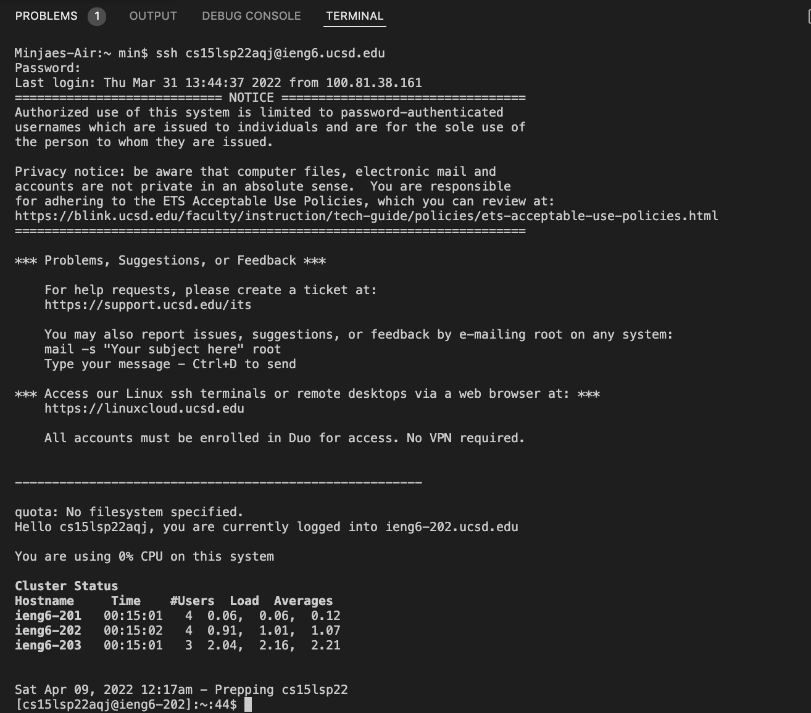

# How to log into a course-specific account?

## step 1- Installing VS Code

## If you don't have VS Code

Go to VS Code website [Link](https://code.visualstudio.com/, ) and download VS Code based on the insruction on website.
If it is sucessfully installed, you should able to open up VS Code window.

## If you already have VS Code

If you already installed VS code, then open up window. 


## step 2- Remotely connecting

Figure out your course ID and type ```ssh (your user name)@ieng6.ucsd.edu``` 
and put the password.

If you are successfully logged in, you can see the similar code below:


## step 3-Trying some commands

Here are some specific commands you can try:

* cd~
* cd
* ls -lat
* ls -a
* cp /home/linux/ieng6/cs15lsp22/public/hello.txt ~/
* cat /home/linux/ieng6/cs15lsp22/public/hello.txt

Here is an example:


## step 4- Moving Files with ```scp```

"scp" is a command that copy a file from your computer to a remote computer. 

1. Create a file called WhereAmI.java and put some content in the file.
2. Run it using javac and java on your computer/
3. and open the terminal and try out the code ```scp WhereAmI.java cs15lsp22zz@ieng6.ucsd.edu``` change zz part in username to your username.
4. put password just as you log into ssh
5. and log into ieng6 server using ssh
6. and put the command ls then you can see the file in your home directory 
7. now you can run it on the ieng6 server using javac and java command

Here is an example:


## step 5- setting an SSH key

Every time we log in or run scp, we have to type our password. This is annoying. Using ```ssh-keygen``` command you can log into ssh without password.
```$ ssh-keygen```

Follow these steps:
  $ ssh-keygen 
  Enter file in which to save the key (/Users/<user-name>/.ssh/id_rsa): /Users/<user-name>/.ssh/id_rsa
  Enter passphrase (empty for no passphrase)
  Enter same passphrase again:

After these steps, you can see code like:
> Your public key has been saved in /Users/<user-name>/.ssh/id_rsa.pub.
> and some random image:
  
Now we need to copy the public (not the private) key to the ssh
Log into SSH again.
After you logged in out the code ```mkdir .ssh```
and then <logout>
and after you back on your client put the code 

```scp /Users/<user-name>/.ssh/id_rsa.pub cs15lsp22zz@ieng6.ucsd.edu:~/.ssh/authorized_keys```
  
