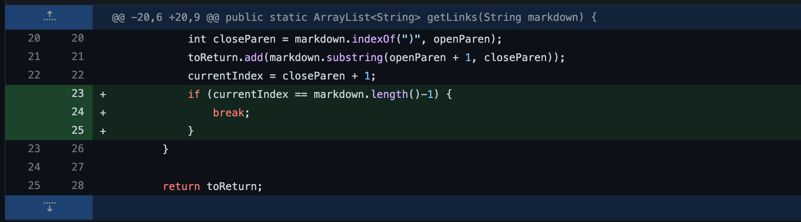
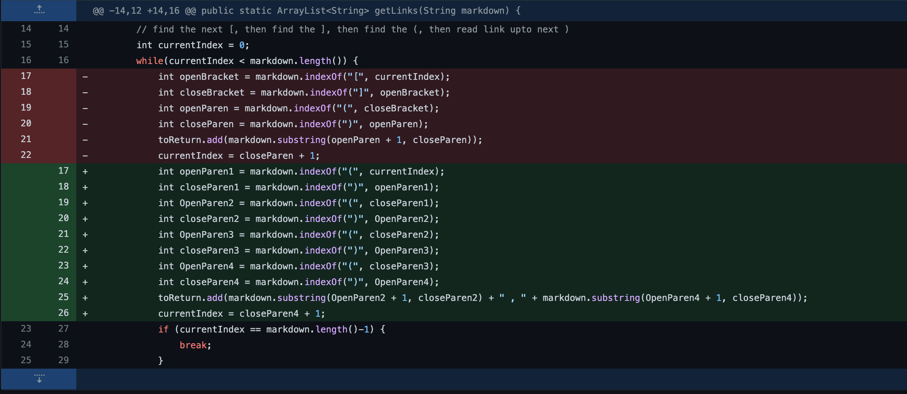
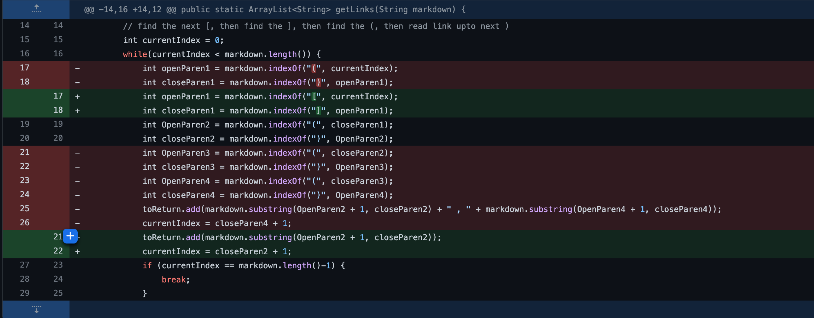

## Code 1

**Show a screenshot of the code change diff from Github for the code 1**



**Link to the test file for a failure-inducing input that prompted you to make that
change**

[Error 1 test](https://github.com/minjismin/markdown-parser/blob/main/test1.md)

**Show the symptom of that failure-inducing input by showing the output of
running the file at the command line for the version where it was failing (this
should also be in the commit message history)**
```
Exception in thread "main" java.lang.OutOfMemoryError: Java heap space
        at java.base/java.util.Arrays.copyOf(Arrays.java:3512)
        at java.base/java.util.Arrays.copyOf(Arrays.java:3481)
        at java.base/java.util.ArrayList.grow(ArrayList.java:237)
        at java.base/java.util.ArrayList.grow(ArrayList.java:244)
        at java.base/java.util.ArrayList.add(ArrayList.java:454)
        at java.base/java.util.ArrayList.add(ArrayList.java:467)
        at MarkdownParse.getLinks(MarkdownParse.java:21)
        at MarkdownParse.main(MarkdownParse.java:32)
```        
       
**Write 2-3 sentences describing the relationship between the bug, the
symptom, and the failure-inducing input.**

Before I fixed this code, I got the error message :
```
Exception in thread "main" java.lang.OutOfMemoryError: Java heap space
        at java.base/java.util.Arrays.copyOf(Arrays.java:3512)
        at java.base/java.util.Arrays.copyOf(Arrays.java:3481)
        at java.base/java.util.ArrayList.grow(ArrayList.java:237)
        at java.base/java.util.ArrayList.grow(ArrayList.java:244)
        at java.base/java.util.ArrayList.add(ArrayList.java:454)
        at java.base/java.util.ArrayList.add(ArrayList.java:467)
        at MarkdownParse.getLinks(MarkdownParse.java:21)
        at MarkdownParse.main(MarkdownParse.java:32)
```

After I added the if code to break the code to not cause the heap exception error, the bug was fixed.

##code 2
**Show a screenshot of the code change diff from Github for the code 1**



**Link to the test file for a failure-inducing input that prompted you to make that
change**

[Error 2 test](https://github.com/minjismin/markdown-parser/blob/main/test2.md)

**Show the symptom of that failure-inducing input by showing the output of
running the file at the command line for the version where it was failing (this
should also be in the commit message history)**
Did not print any output and stuck in the infinity loop


**Write 2-3 sentences describing the relationship between the bug, the
symptom, and the failure-inducing input.**

By adding more lines, I could print out the correct output by rearragning the index. It stucked at the infinity loop at first but by rearranging index number and adding index number by crating new integer lines, I could fix the bug.

##code 3

**Show a screenshot of the code change diff from Github for the code 1**




**Link to the test file for a failure-inducing input that prompted you to make that
change**

[Error 3 test](https://github.com/minjismin/markdown-parser/blob/main/test3.md)

**Show the symptom of that failure-inducing input by showing the output of
running the file at the command line for the version where it was failing (this
should also be in the commit message history)**

when I run MarkdownParse, output was
```
[# Title

[link1]( , # Title

[link1](]
```

**Write 2-3 sentences describing the relationship between the bug, the
symptom, and the failure-inducing input.**

By deleting a few lines, I could rearrange the index input and thus could print out the correct output.
