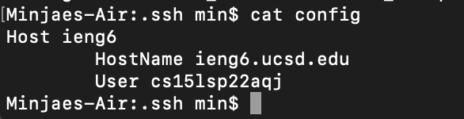
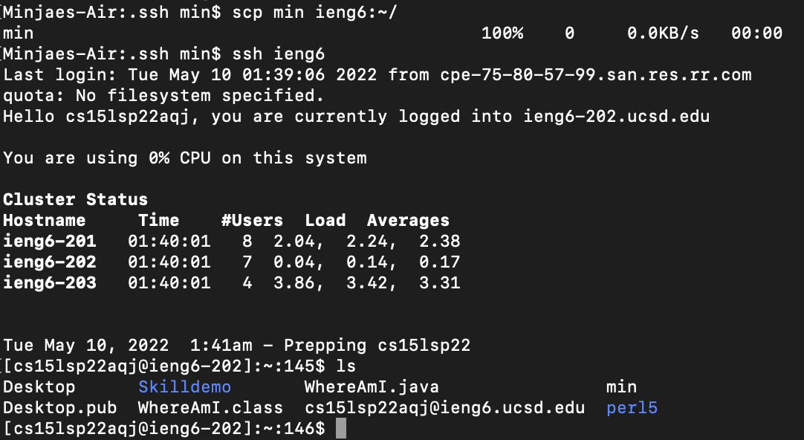
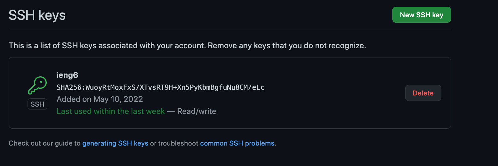
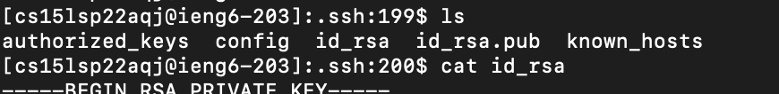
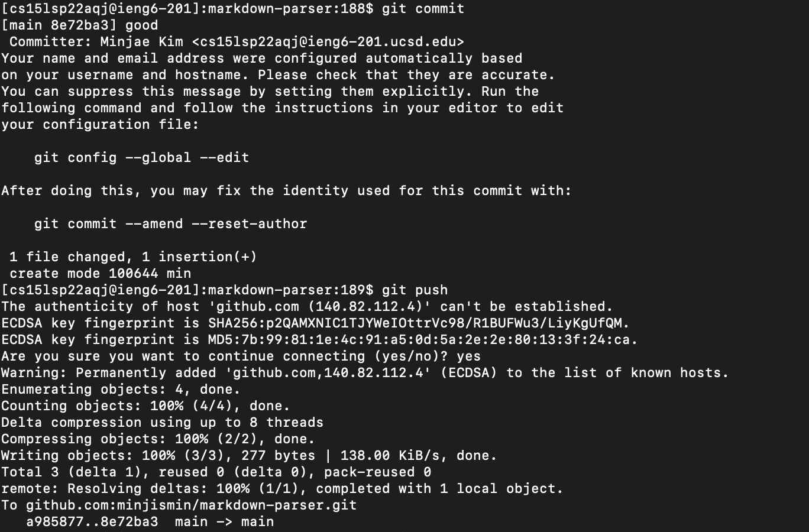

#Lab report 3

## Streamlining ssh Configuration

### 1



I created config file which contained 

```
Host ieng6
  HostName ieng6.ucsd.edu
  User cs15lsp22aqj
```

By creating this I could login to ieng6 remote server by just typing >ssh ieng 6


### 2



So as I said, I could login using ieng6 and also could copy the file from my local account by using command "scp"


## Setup Github Access from ieng6

### 1
I created new public key to access my github account



### 2
My private key is saved under the file named id_rsa



### 3
By setting up that, I could commit and push while I logged into ieng6 account



### 4
The link of my commit
[commit link](https://github.com/minjismin/markdown-parser/commit/8e72ba3baf603a9ba367eb1409cb098d75d365b4)

## Copy whole directories with scp -r

### 1

