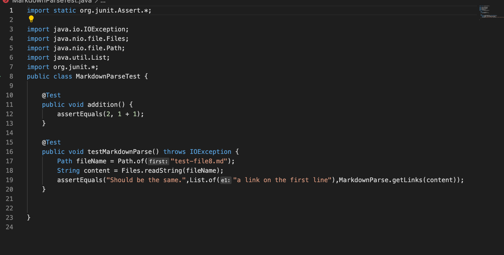
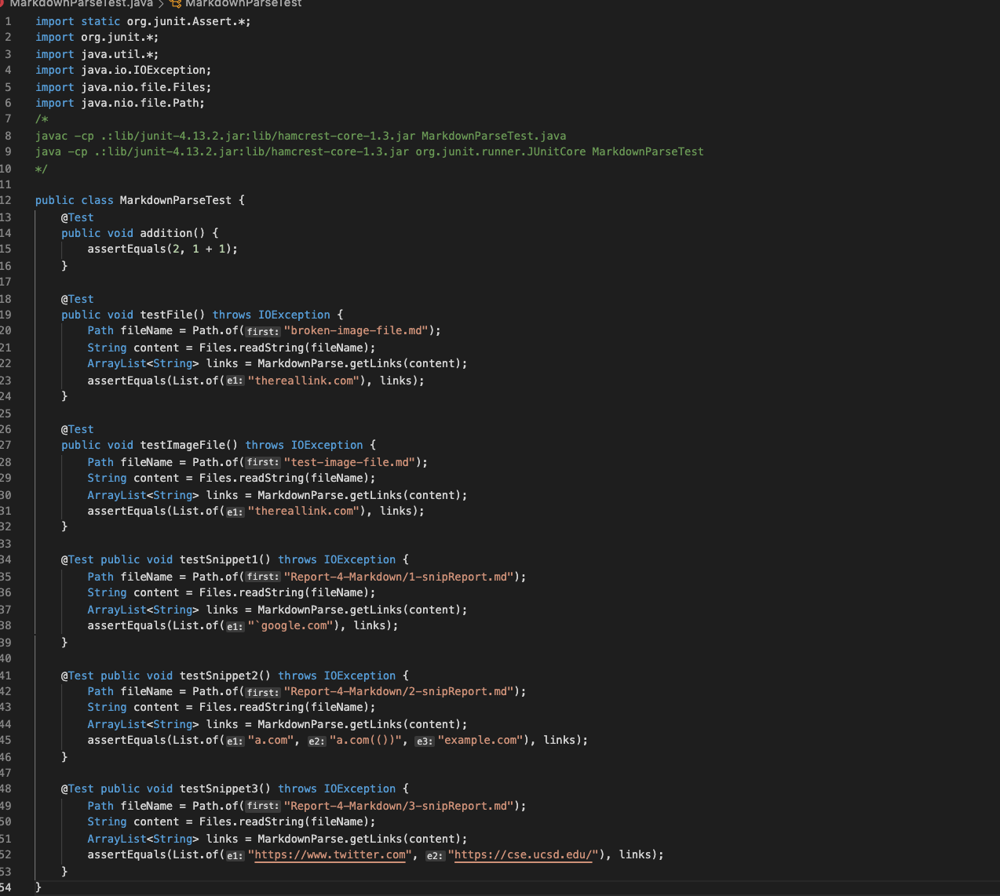
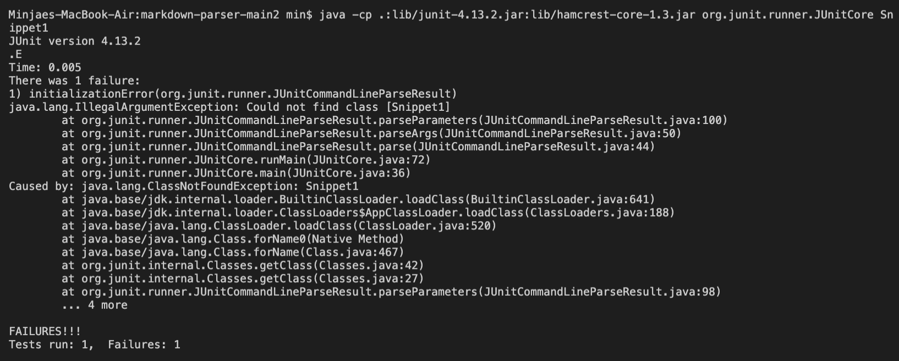
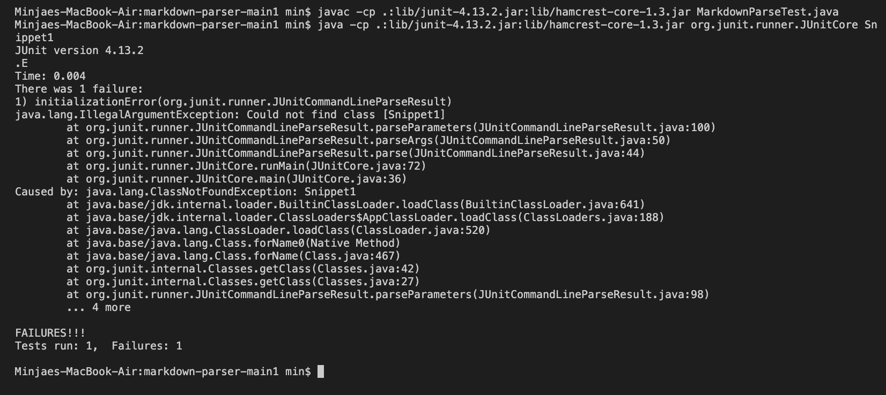
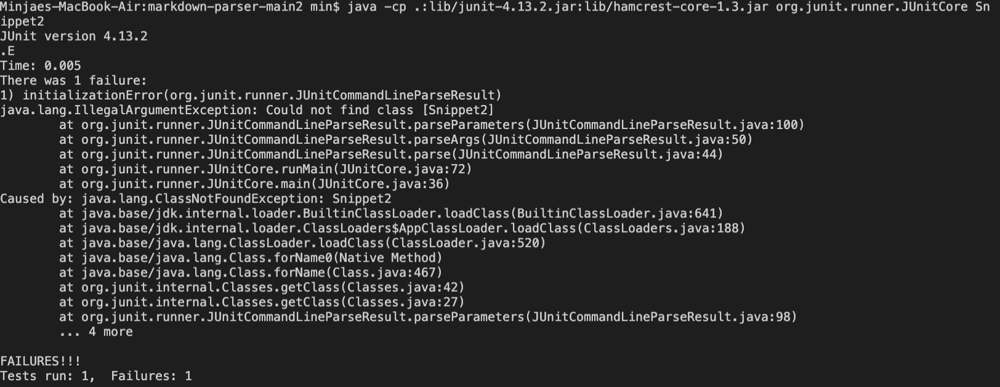
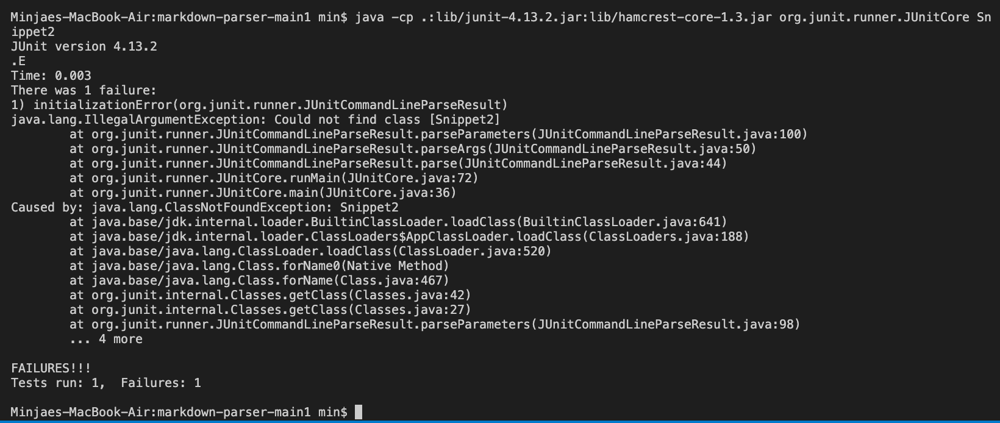
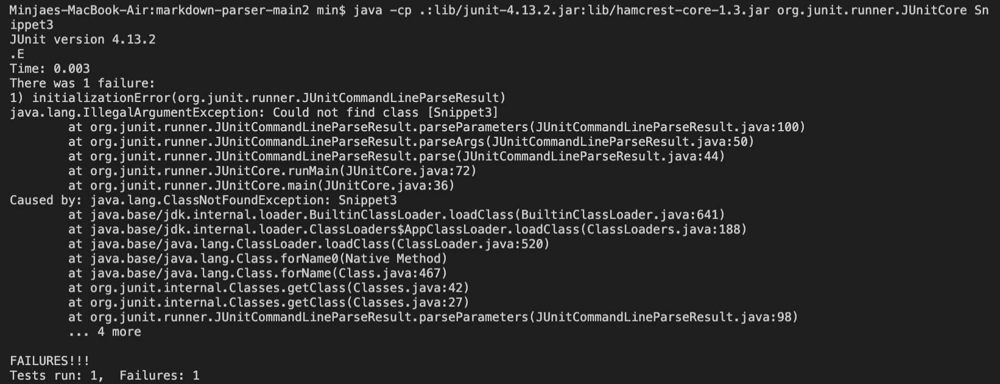
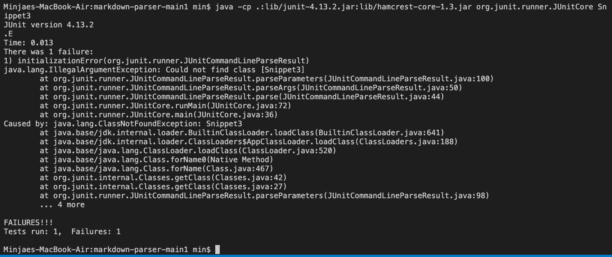

Link to my group repository: [link1](https://github.com/mikayladalton2/markdown-parser)
Link to reviewed repository: [link2](https://github.com/ezh247467/markdown-parser)


# code 



 

# Snippet 1

## Test

```
{
  [a link`](url.com)
  [another link](`google.com)`
  [`cod[e`](google.com)
  [`code]`](ucsd.edu)
}
```


## Expected Output

`
[url.com]
`




## Possible code change

To process Snippet 1 as a test, we need to create whole new method which can read .md files as strings and distinguish "backticks." 

# Snippet 2

## Test
```
{
[a [nested link](a.com)](b.com)

[a nested parenthesized url](a.com(()))

[some escaped \[ brackets \]](example.com)
}
```
## Expected Output

`
[a.com a.com(()), exmaple.com]
`



## Possible code changes

To take snippet 2 as a test, we also need to create whole new method which can read nested parenthesis, brackets, and escaped brackets. New code would need many lines which can distinguish open and end of parenthesis, bracket, and escaped bracket and figure out links in the test. 

# Snippet 3

## Test
```
{
  [this title text is really long and takes up more than 
one line

and has some line breaks](
    https://www.twitter.com
)

[this title text is really long and takes up more than 
one line](
https://sites.google.com/eng.ucsd.edu/cse-15l-spring-2022/schedule
)


[this link doesn't have a closing parenthesis](github.com

And there's still some more text after that.

[this link doesn't have a closing parenthesis for a while](https://cse.ucsd.edu/


)

And then there's more text
}
```

## Expected Output

`
[https://www.twitter.com,https://sites.google.com/eng.ucsd.edu/cse-15l-spring-2022/schedule,https://cse.ucsd.edu/]
`





## Possbile code changes

To read snippet 3, code should be able to find missing bracket and parenthesis. Therefore, by adding codes that can find out the missing part and can take links as strings, added code will help orignial code to successfully read snippet 3. 


