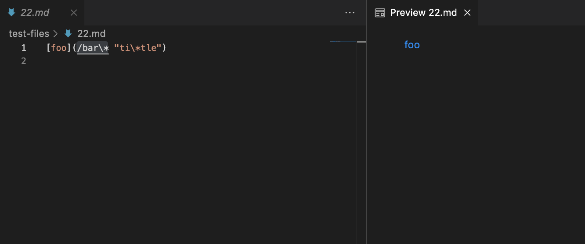
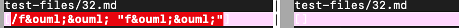
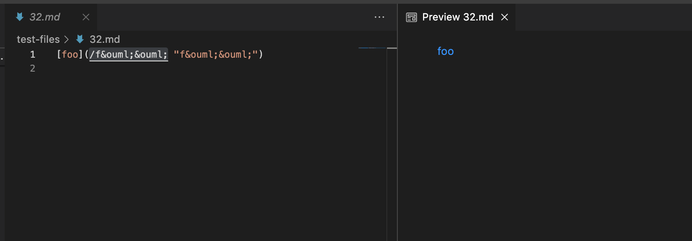
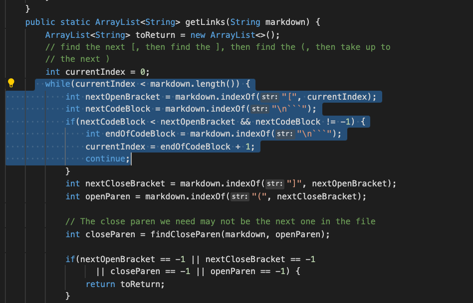
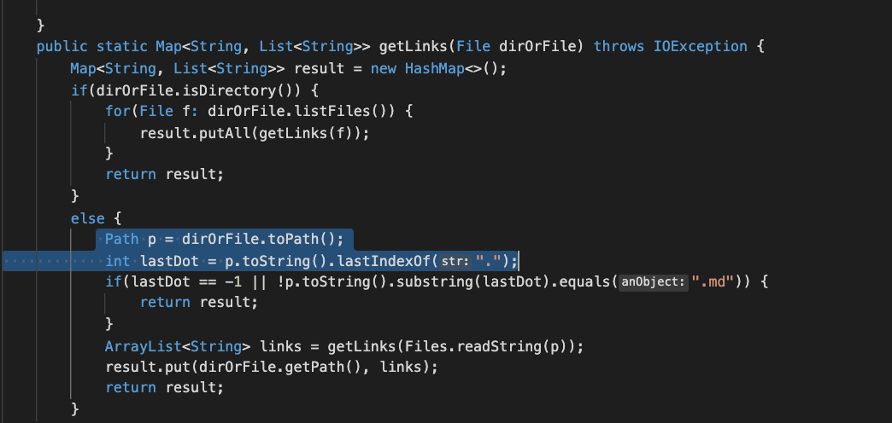

# Explain

1. How you found the tests with different results (Did you use vimdiff on the results of running a bash for loop? Did you search through manually? Did you use some other programmatic idea?)
-> I used vimdiff to see different results.

2. Provide a link to the test-file with different-results (in the provided repository or your repository , either is fine)
-> 
https://github.com/nidhidhamnani/markdown-parser/blob/main/test-files/22.md
https://github.com/nidhidhamnani/markdown-parser/blob/main/test-files/32.md

3. For each test:
○ Describe which implementation is correct, or neither if both give the
wrong output
○ Indicate both actual outputs (provide screenshots) and also what the
expected output is (list the links that are expected in the output).

## for 22.md
Both gave the wrong output
Actual output:

Expected output:
/bar\*
[test22 link](https://github.com/nidhidhamnani/markdown-parser/blob/main/bar*)

## for 32.md
Both gave the wrong output
Actual output:

Expected output:
/f&ouml;&ouml;

4. problem in code 1:
   This test gives the wrong output because the code to seperate link from the snippet didn't work due to the absence of distinguisher. The code I attached below does not have any code that can differentiate code from all text. To solve this problem, we should add distinguisher which can separate link from texts.

6. Problem in code 2:
   This test gives the wrong output because this code is supposed to give the link in the test but it gives both link and text in the "". 
   This happened because the code can not read the link since there is no "." at the end. MarkdownParse code takes all things as one in the paranthesis.
   Considering this, we can fix this bug by adding code that can differentiate text in the paranthesis().

