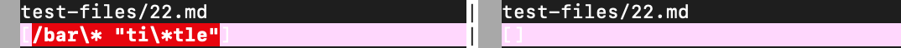

# Explain

1. How you found the tests with different results (Did you use vimdiff on the results of running a bash for loop? Did you search through manually? Did you use some other programmatic idea?)
-> I used vimdiff to see different results.

2. Provide a link to the test-file with different-results (in the provided repository or your repository , either is fine)
-> 
https://github.com/nidhidhamnani/markdown-parser/blob/main/test-files/22.md
https://github.com/nidhidhamnani/markdown-parser/blob/main/test-files/32.md

3. For each test:
○ Describe which implementation is correct, or neither if both give the
wrong output
○ Indicate both actual outputs (provide screenshots) and also what the
expected output is (list the links that are expected in the output).

## for 22.md
Both give the wrong output
Actual output:

Expected output:
/bar\*
[test22 link](https://github.com/nidhidhamnani/markdown-parser/blob/main/bar*)

## for 32.md
Both give the wrong output
Actual output:

Expected output:
/f&ouml;&ouml;

4. Problem in code
   Both test give the wrong output because both test are supposed to give the link in the test but it give both link and text in the "". 
   This happened because there is no code that can differentiate link and words in the test. MarkdownParse code takes all things as one in the paranthesis.
   Considering this, we can fix this bug by adding code that can differentiate text in the paranthesis().

